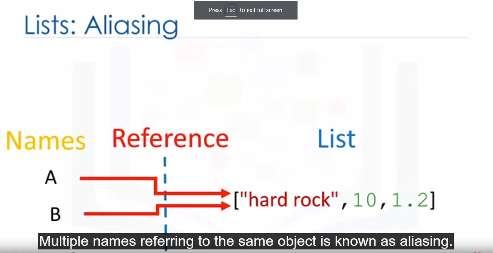

what is my python version:
```python
import sys
sys.version
```

float info, largest and smallest numbers available by float:
```python
 sys.float_info
 ```
## Strings:
strings are **immutable** so you can not change the value of the string, but you can create new string:
```python
name = [Micheal jackson]
name[0] = 'j'                   # it is incorrect
name  = name + 'is the best'    # correct
```
string | result
------ |-------
\n    |  new line
\t    | tab
\\  | print a backslash

```
# using r :
# r will tell python that string will be display as raw string

print(r"this will print a backslash \ in the output")
```
stride, Use a stride value of 2 to print out every second character of the string `name`:
```
mame = "012345678"
name[::2] # is equal to '02468'
# or
name[0:9:2]
```


